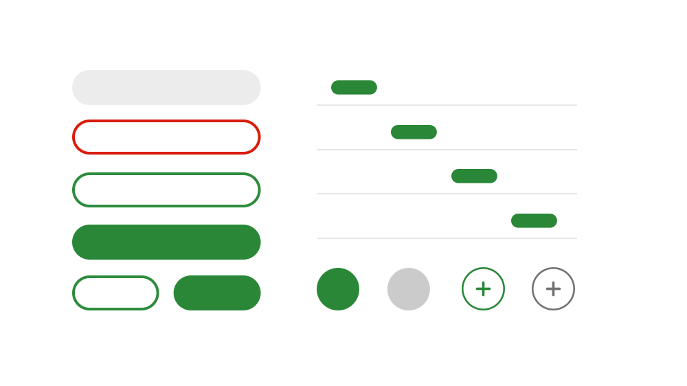

# Spindle Hooks (In development)

Spindle (Ameba Design System) Hooks

<p align="center">
  
</p>

> Spindle Hooks は試験開発中のため、大幅に変更される可能性があります。安定版リリースまでの間はバージョン番号は 0 となり、バージョンに関わらず breaking change が行われることがありますので、利用時には注意してください。変更内容は、[CHANGELOG](CHANGELOG.md)に記載されています。

 

Spindle Hooksは、Amebaのデザインシステム「Spindle」で定義されたコンポーネントの機能部分にフォーカスし、再利用可能なReact Hooksを提供するライブラリです。様々なタイプのプロジェクトに導入できるように設計されています。

## インストール

```
npm install @openameba/spindle-hooks
```

```
yarn add @openameba/spindle-hooks
```

## 利用方法

Spindle Hooksは以下のように利用できます。

```js
import { render } from 'react-dom';
import ReactDOM from 'react-dom';
import { useTimeDistance } from '@openameba/spindle-hooks';

function App() {
  const publishedAt = '2022-03-11T01:15:51.237Z';
  const [dateString] = useTimeDistance(publishedAt);
  return <time datetime={publishedAt}>{dateString}</time>;
}

ReactDOM.render(<App />, document.querySelector('#app'));
```

Spindle HooksはSpindle UIと同様にmodule版の配信もしています。利用する際には、[導入ガイド](https://github.com/openameba/spindle/pull/175)を参考にしてください(リンク先はspindle-uiなのでspindle-hooksに置き換えてください)。

## Hooks 一覧

利用可能なReact Hooksは、[Storybook](https://ameba-spindle-hooks.web.app/)で公開されています。各コンポーネントの開発状況は[Stoybook Doc](https://ameba-spindle-hooks.web.app/?path=/docs/usecarousel--normal)のStability Budgeで以下のように表されています。

-  想定された機能が実装、テストされており本番環境で利用できます
-  足りていない機能や不安定な動作があり、まだ完全ではないですが、本番環境で利用できます
-  開発中のため、本番環境での利用はしない方がよいでしょう
-  実験的な機能で大きな変更や削除される可能性があります
-  廃止される予定のため、できるだけはやく利用を停止してください

## ブラウザサポート

Spindle HooksはFirefox、Google Chrome、Microsoft Edge、Safariの最新版とInternet Explorer 11で動作確認しています。

## 開発方法

```
yarn install
yarn dev # storybookが起動します
```

新規Hooksを追加する際には利用方法がイメージしやすいようにStorybookも追加します。
必要に応じてユニットテストも追加します。

ユニットテストは以下のように実行します。

```sh
yarn test:interaction
```

## ライセンス

Spindle HooksはMITライセンスで公開されています。ただし、アイコンは[Spindle Icons](../spindle-icons/)に準じて、Creative Commons BY-NC-ND 4.0ライセンスで公開されています。

## 関連ドキュメント

- [Design Doc](docs/design-doc.md)
