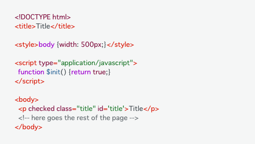

# Spindle Syntax Themes

Spindle Syntax Themesは、Spindleで定義された色を利用したコードシンタックステーマ(CSS)です。LightテーマとDarkテーマが用意されており、どちらも背景色とテキスト色のコントラスト比を担保するように作成されています。

実際のコードに適用されたスタイルは、[サンプルページ](https://ameba-spindle-syntax.web.app/)で閲覧できます。

## テーマ

### Light


### Dark


# Usage
Spindle Syntax Themesを利用するには、npm経由で読み込む(推奨)もしくは、CDN経由で読み込む方法があります。現在は、Highlight.jsに対応しています。Highlight.jsの使い方は[公式サイト](https://highlightjs.org/)を参照してください。

## npm or pnpm
```
npm install @openameba/spindle-syntax-themes
```

```
pnpm add @openameba/spindle-syntax-themes
```

インストールしたCSSは、SassやPostCSSなどで読み込んで利用します。

```css
@import '@openameba/spindle-syntax-themes/highlightjs-light.css'
```

```css
@import '@openameba/spindle-syntax-themes/highlightjs-dark.css'
```

## CDN
```html
<link rel="stylesheet" href="https://unpkg.com/@openameba/spindle-syntax-themes@0.1.0/highlightjs-light.min.css">
```

```html
<link rel="stylesheet" href="https://unpkg.com/@openameba/spindle-syntax-themes@0.1.0/highlightjs-dark.min.css">
```

HTMLからCDNを経由して直接読み込みます。CDNの配信のため、サイトの表示速度に影響を及ぼす可能性があります。

## バージョニング
### 0.x, 1.x
Highlight.jsのバージョン10と互換性があります。それ以外のバージョンでも利用できる可能性はありますが、動作確認していません。
