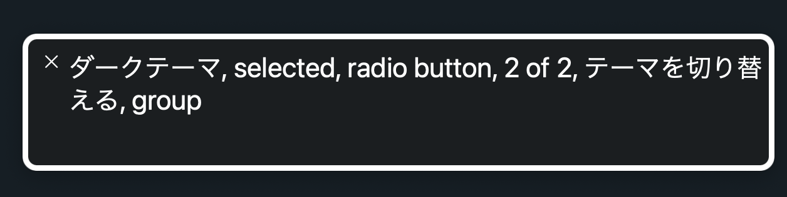

## 前提 / Context

Amebaでダークテーマを提供していくにあたり、テーマを切り替えるスイッチを定義しました。このリポジトリではそれを複数のWebサイトで使えるコンポーネントを作成します。なお、ライトテーマ・ダークテーマで利用するカラーパレットはCSS custom propertiesとしてameba-color-palette.cssに定義さているのでそれを利用する前提とします。

## 目指すこと / Goals

- Spindleで定義されているライトテーマとダークテーマを切り替えるスイッチを提供します
- スタイルは定義済みなのでそれを簡単に流用できるようにします
- マウスやタッチだけでなく、キーボードでも操作できるように作成します

## 目指さないこと / Non-goals

- Amebaで利用する前提のため、カスタマイズの自由度は必須ではありません
- テーマ切り替えはプラスアルファの機能であるため、すべてのブラウザで動作することを目指しません

## 概要 / Overview

機能的に[GoogleChromeLabs/dark-mode-toggle](https://github.com/GoogleChromeLabs/dark-mode-toggle)で満たせるため、このコンポーネントを拡張し、spindle-theme-switchとして配信します。

- 単独で動作可能なのでWeb Componentsとして作成します
- モダンブラウザでのテーマ提供を前提として、ES Moduleとして配信します
- dark-mode-toggleのswitchはradioボタンで作成されているため、スクリーンリーダーでも適切に読み上げられます。複数の選択肢から選択するという意味でも問題はなさそうです

また、すでに[Ameba Accessibility Guidelinesに導入されている](https://github.com/openameba/a11y-guidelines/pull/223)ので、それをベースに移植します。

## どのようにやっていくか / Approach, Detailed design

### 実装例

```tsx
import { DarkModeToggle } from 'https://unpkg.com/dark-mode-toggle';

export class SpindleThemeSwitch extends DarkModeToggle {
	constructor() {
    super();
		
		// Spindle用のスタイルを設定します
    const styleEl = document.createElement('style');
    styleEl.textContent = ``;
		this.shadowRoot?.appendChild(styleEl);

    // 各テーマにラベルテキストを付与します
    // 本来は<label>内にテキストを追加したいですが、::beforeで表示されているアイコンを消すことなく
    // テキストだけ非表示にできないので、属性を追加しています
    // 良い方法があれば変更したいです
    this.shadowRoot
    ?.querySelector('[part=lightRadio]')
    ?.setAttribute('aria-label', 'ライトテーマ');
    this.shadowRoot
    ?.querySelector('[part=darkRadio]')
    ?.setAttribute('aria-label', 'ダークテーマ');

    // ameba-color-palette.css gets mode from this dataset (data-color-scheme)
    const html = document.documentElement;
    html.dataset.colorScheme = this.mode;
    document.addEventListener('colorschemechange', () => {
      html.dataset.colorScheme = this.mode;
    });
	}
}

const ELEMENT_NAME = 'spindle-theme-switch';
customElements.define(ELEMENT_NAME, SpindleThemeSwitch);
```

実際にはdark-mode-toggleを経由し以下のマークアップが挿入されます。

```html
<form part="form">
  <fieldset part="fieldset">
    <legend part="legend">テーマを切り替える</legend>
    <input part="lightRadio" id="l" name="mode" type="radio" aria-label="ライトテーマ">
    <label part="lightLabel" for="l"></label>
    <input part="darkRadio" id="d" name="mode" type="radio" aria-label="ダークテーマ">
    <label part="darkLabel" for="d"></label>
  </fieldset>
</form>
```

これらにより、スクリーンリーダでも適切にテーマの選択機能として読み上げられます。



### 利用方法

実際に利用する際はこんな感じです。Amebaのサービスで利用されている際にはameba-color-palette.cssが読み込まれていますが、それがなくても動作するように作成はします。

```html
<head>
  <meta name="color-scheme" content="light dark">
  <!-- テーマのスタイルを読み込むには3つの方法があります -->
  <!-- Option 1: ameba-color-palette.cssを読み込み、その中で指定されているCSSカスタムプロパティを利用します -->
  <link rel="stylesheet" href="https://unpkg.com/ameba-color-palette.css/ameba-color-palette.css">
  <link rel="stylesheet" href="style.css">
  <!-- Option 2: <link media=""> を利用してそれぞれのテーマCSSを読み込みます -->
  <link rel="stylesheet" href="light.css" media="(prefers-color-scheme: light)">
  <link rel="stylesheet" href="dark.css" media="(prefers-color-scheme: dark)">
  <!-- Option 3: カスタム属性を利用してそれぞれのテーマのスタイルを指定します -->
  <style>
    /* Set light theme here */

    /* Set dark theme */
    :root[data-color-scheme="dark"] {}
    @media (prefers-color-scheme: dark) {
      :root:not([data-color-scheme]),
      :root[data-color-scheme="dark"] {}
    }
  </style>
  <!-- type=moduleを指定してスクリプトを読み込みます -->
  <script src="https://unpkg.com/@openameba/spindle-theme-switch/spindle-theme-switch.js" type="module"></script>
</head>

<body>
  <spindle-theme-switch appearance="switch" legend="テーマを切り替える" remember></spindle-theme-switch>
</body>
```

### 型定義の配信

基本的にはHTMLに要素とスクリプトの読み込みを挿入すれば動作しますが、拡張したい場合やJSXでの利用をふまえて型定義を配信したいと思います。

設定内容は以下を想定しています。

```typescript
import { DarkModeToggle } from 'dark-mode-toggle';

export declare class SpindleThemeSwitch extends DarkModeToggle {
  constructor();
}

export type SpindleThemeToggleAttribute = {
  appearance: 'switch';
  legend?: string;
  permanent?: boolean;
};

declare namespace JSX {
  interface IntrinsicElements {
    'spindle-theme-switch': SpindleThemeToggleAttribute;
  }
}
```

JSXでの利用時は以下のコメントを冒頭に挿入します。

```typescript
/// <reference types="@openameba/spindle-theme-switch" />
```

## 他の手段

### 自作

Ameba Accessibility Guidelinesに導入する時は自作しましたが、要件的にdark-mode-toggleの拡張で不足がないので今回は自作しません。要件が追加された際には自作になるかもしれません。(自作の場合はAmeba Accessibility Guidelinesのものを流用で作れるには作れます)

### dark-mode-toggleをそのまま使う

dark-mode-toggleを使う場合、各アプリケーションでスタイルの設定をしなければならず、異なったスタイルや振る舞いが定義されてしまうかもしれません。それらの一貫性を担保するためspindle-theme-switchとして公開します。

### Reactコンポーネントとして配信

今回はReactでないページでも使えるようにWeb Componentsとして公開します。Reactや各種UIライブラリからもWeb Componentsを挿入できます。

## 想定される問題 / Drawback, Risk

- 要件が追加され、dark-mode-toggleでは実現できなくなる可能性があります
