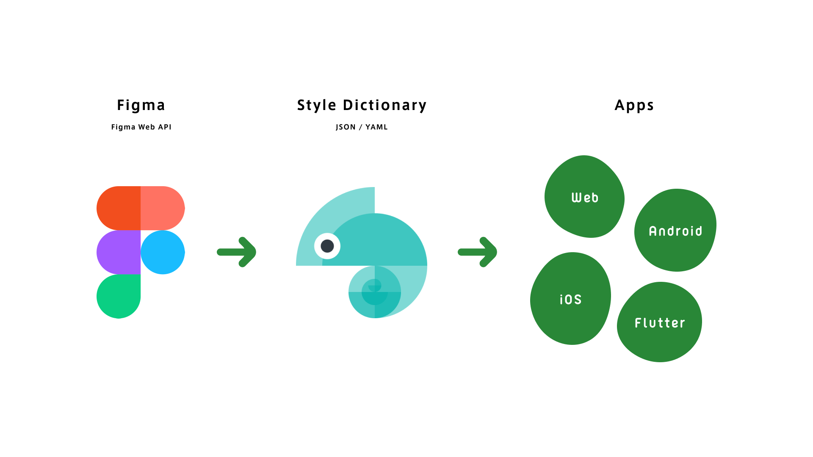

# Spindle Tokens (In development)

Spindle (Ameba Design System) Design Tokens

<p align="center">
  
</p>

Spindle TokensはAmebaのデザインシステム「Spindle」で定義されたデザイントークンを管理します。デザイントークンは[Style Dictionary](https://github.com/amzn/style-dictionary)準拠のJSON形式で管理され、各アプリケーション向けの形式に変換されます。

## 配布されるファイル

### JSON

デザイントークンのデータをJSON(オブジェクト)形式で表現した形式です。

`dist/json/spindle-tokens.json`

```json
{
  "Color": {
    "Primitive": {
      "Black": {
        "100": {
          "value": "rgba(0, 0, 0, 1)",
          "filePath": "tokens/color/primitive.json",
          "isSource": true,
          "original": {
            "value": "rgba(0, 0, 0, 1)"
          },
          "name": "100",
          "attributes": {},
          "path": [
            "Color",
            "Primitive",
            "Black",
            "100"
          ]
        }
      }
    }
  }
}
```

### JSON Flat

デザイントークンのデータをJSON(配列)形式で表現した形式です。データのソートやフィルタリングする際に役立つかもしれません。以下の点がJSON形式と異なっていますので、注意して利用してください。

- プロパティ`value`は`string`に統一されます
- プロパティ`original.value`は元データ型を保持します
- `path`を`.`で連結した`pathString`プロパティが付与されます

`dist/json/spindle-tokens-flat.json`

```json
[
  {
    "value": "rgba(0, 0, 0, 1)",
    "filePath": "tokens/color/primitive.json",
    "isSource": true,
    "original": {
      "value": "rgba(0, 0, 0, 1)"
    },
    "name": "100",
    "attributes": {},
    "path": [
      "Color",
      "Primitive",
      "Black",
      "100"
    ],
    "pathString": "Color.Primitive.Black.100"
  }
]
```

### CSS

デザイントークンをCSSカスタムプロパティとして利用できます。

```
yarn add @openameba/spindle-tokens
```

カテゴリごとにファイルに分けられているため必要なトークンだけを読み込むことをおすすめします。

```css
import '@openameba/spindle-tokens'; /* 全部のトークンが読み込まれます、Productionでの利用は非推奨です */
import '@openameba/spindle-tokens/dist/css/spindle-tokens-animation.css'; # アニメーション
```

## 開発方法

```sh
# Figmaで定義されたデザイントークンをJSON形式のファイルに変換し、保存します
FIGMA_TOKEN=*** FIGMA_COLOR_PRIMITIVE_FILE_ID=*** FIGMA_COLOR_THEME_FILE_ID=*** FIGMA_COLOR_THEME_DARK_FILE_ID=*** FIGMA_DROP_SHADOW_FILE_ID=*** yarn export

# JSONファイルを元に各プラットフォームで利用する形式に変換します
yarn build
```

## ライセンス
Spindle TokensはMITライセンスで公開されています。
